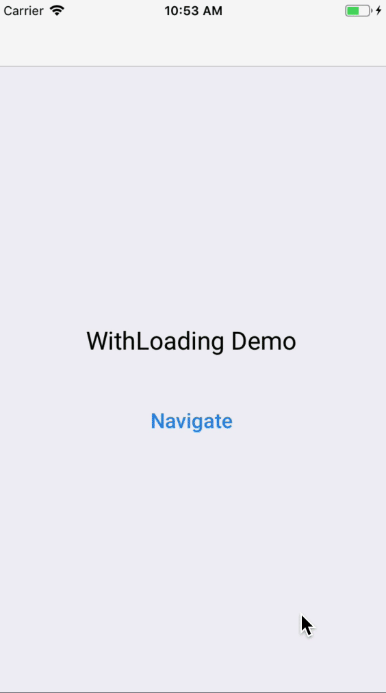
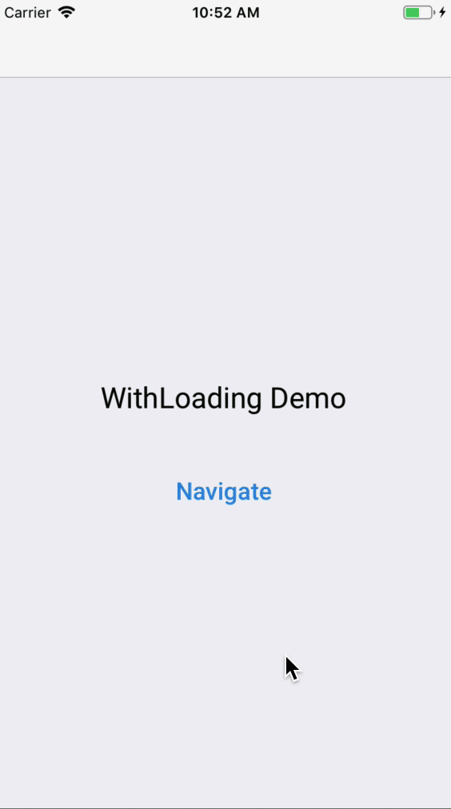

# react-native-with-loading

## Installation
`npm install react-native-with-loading`


## What is it?
A simple react-native Higher Order Component (HOC) to navigate between screens with better fluidity by showing a spinner until everything is loaded.



### How it works?
The component wrapped with this HOC initially rendy nothing except the spinner. It uses the librairy [react-native-loading-spinner-overlay](https://github.com/joinspontaneous/react-native-loading-spinner-overlay) to display an overlay over the entire app. Once it is mounted, it waits for the end of every Interactions before starting to render the main component. To remove the spinner, you need to call the props `onComponentLoaded()`. It can be, for example, directly after the first render or you can wait to load data first.



## Usage

```javascript
import React from 'react';
import withLoading from 'react-native-with-loading';

class BigScreen extends React.Component {

  componentDidMount() {
    this.props.onComponentLoaded();
  }

  render() {
    return (
      //This is your big Screen
    )
  }
}

export default withLoading(BigScreen);
```